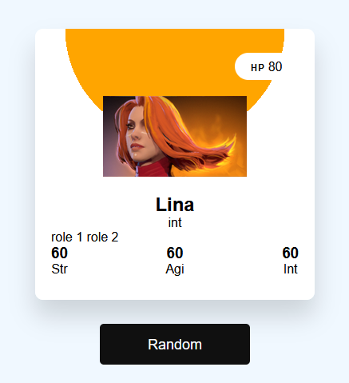
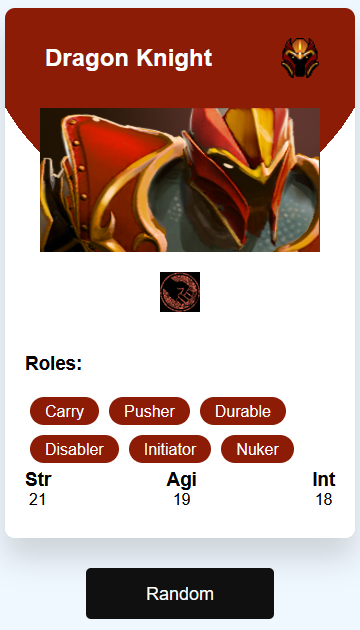
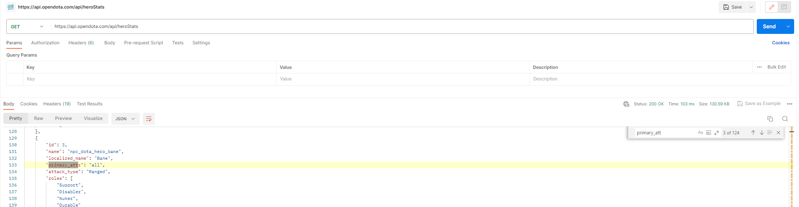

# Dota Card Generator
 Generates a random Dota 2 character as a card displaying basic information and stats. Data is grabbed from the [Open Dota API](https://docs.opendota.com/) using the "GET /heroStats" call, then a hero is randomly selected and a card is then generated using that hero's information. A color theme is also determined by the three hero attributes agillity (green), intelligence (blue), and strength (red).

Initial look at the project:  

Current State:  

**Update** - Aug 2023
Added Universal (all) attribute and fixed default images.

### TODO
- add other unused stats: armor, magic resist, attack type, movement speed
- stylize newly added stats
- change how card loads to remove image delay
